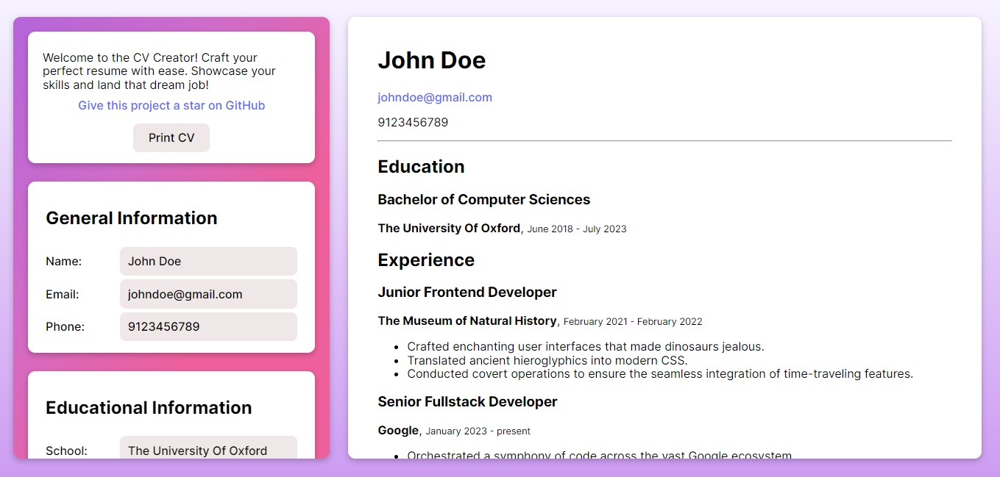

# CV creator



[Project demo](https://odin-cv-application-project.vercel.app/)

## Description

The CV Creator is a web application that allows users to easily build and edit their curriculum vitae. It simplifies the process of adding general information, educational experience, and practical experience. Users can edit and submit each section individually, providing a seamless and user-friendly CV building experience.

This project was an [assignment](https://www.theodinproject.com/lessons/node-path-react-new-cv-application) from The Odin Project.

## Features

- Add your general info, and as many educational and work sections as needed.
- Sleek responsive design.
- Automatic theme change.
- Print your CV or save to a PDF.

## Technologies Used

[](https://skillicons.dev)

## Installation

To install the project, follow these steps:

```bash
git clone https://github.com/shravzzv/ODIN-CV-application-project
cd ODIN-CV-application-project
npm install
npm run dev
```

## Usage

1. Open the app and start entering your information.
2. Sections in the CV get automatically updated as your type in the forms.
3. After entering your data, click **print CV** to save to PDF or print it.

## How to Contribute

If you'd like to contribute, follow these steps:

1. Fork the repository on GitHub.
2. Clone your fork locally.

   ```bash
   git clone [your forked repo url]
   cd ODIN-CV-application-project
   ```

3. Create a new branch for your feature or bug fix.

   ```bash
   git checkout -b feature-or-bug-fix-name
   ```

4. Make your changes, commit them, and push them to your fork.

   ```bash
   git add .
   git commit -m "Your commit message here"
   git push origin feature-or-bug-fix-name
   ```

5. Open a Pull Request on GitHub, comparing your branch to the original repository's `main` branch.

## Issue Tracker

Find a bug or want to request a new feature? Please let us know by submitting an [issue](https://github.com/shravzzv/ODIN-CV-application-project/issues).

## License

This project is licensed under the MIT License - see the [LICENSE](LICENSE) file for details.

---
